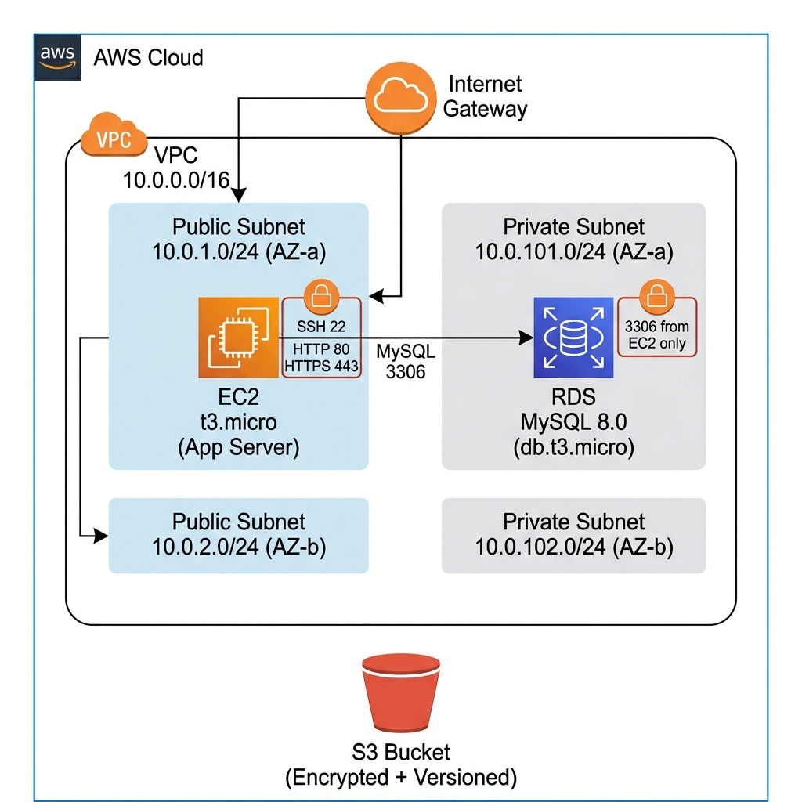

# Infrastructure as Code (IaC) - Project Documentation

## Capstone Project 3: Core Cloud Resources with Terraform

**Author:** Rakesh Duvva
**Region:** Asia Pacific (Mumbai) - ap-south-1
**Provider:** AWS | **Tool:** Terraform v1.15.1
**Total Resources:** 22 (across 4 modules)

---

## Table of Contents

1. [Architecture Overview](#architecture-overview)
2. [Terraform Workflow](#terraform-workflow)
   - [Initialization](#1-terraform-init)
   - [Planning](#2-terraform-plan)
   - [Deployment](#3-terraform-apply)
   - [Destruction](#4-terraform-destroy)
3. [AWS Console Verification](#aws-console-verification)
   - [Networking (VPC, Subnets, Route Tables, IGW)](#networking)
   - [Compute (EC2, Security Groups)](#compute)
   - [Storage (S3 Bucket)](#storage)
   - [Database (RDS MySQL)](#database)
4. [Infrastructure Dashboard](#infrastructure-dashboard)
5. [Second Deployment Cycle](#second-deployment-cycle)

---

## Architecture Overview

The infrastructure follows a modular Terraform architecture with 4 modules:

| Module | Resources | Description |
|--------|-----------|-------------|
| Networking | 12 | VPC, 4 Subnets, IGW, 2 Route Tables, 4 Route Table Associations |
| Compute | 2 | EC2 Instance (t3.micro), Security Group |
| Storage | 5 | S3 Bucket, Versioning, Encryption, Lifecycle, Public Access Block |
| Database | 3 | RDS MySQL (db.t3.micro), DB Subnet Group, Security Group |

---

## Terraform Workflow

### 1. Terraform Init

Initializes the working directory, downloads the AWS provider, and prepares the modules.

.png)

*The screenshot shows `terraform init` completing successfully with the hashicorp/aws v5.100.0 provider installed and the backend initialized.*

---

### 2. Terraform Plan

Previews the execution plan showing all 22 resources that will be created.

.png)

*The plan begins by reading the Amazon Linux AMI data source and listing all resources to be created, starting with `module.compute.aws_instance.app`.*

.png)

*The plan summary showing planned outputs including subnet IDs, RDS endpoint, S3 bucket details, and the VPC ID. Plan confirms: "22 to add, 0 to change, 0 to destroy".*

---

### 3. Terraform Apply

Deploys all 22 resources to AWS. The RDS instance takes the longest (~7 minutes).

.png)

*Terraform presents the full plan and prompts "Do you want to perform these actions?" - entering `yes` to confirm deployment.*

.png)

*Shows the terraform plan output during the first deployment cycle, with the database module's `aws_db_instance` resource details including encryption, storage type (gp3), and tags.*

.png)

*The RDS MySQL instance (`module.database.aws_db_instance.main`) takes approximately 7 minutes to create. All other resources complete within seconds. Final output: "Apply complete! Resources: 1 added, 0 changed, 0 destroyed" (last resource).*

.png)

*Deployment outputs showing:*
- *EC2 Instance ID: `i-08f1a5ba3ecbfde30`*
- *EC2 Public IP: `13.233.107.254`*
- *S3 Bucket ARN: `arn:aws:s3:::iac-capstone-app-storage-2026`*
- *RDS Endpoint: `iac-capstone-dev-mysql.cvoga6e8oaeb.ap-south-1.rds.amazonaws.com:3306`*
- *VPC ID: `vpc-056640e08e088f75f`*

---

### 4. Terraform Destroy

Tears down all 22 resources to avoid AWS charges.

.png)

*Terraform reads the current state of all 22 resources before generating the destruction plan.*

.png)

*The destruction plan shows detailed attributes of each resource that will be removed, including subnet CIDR blocks, availability zones, and tags.*

.png)

*Resources are destroyed in dependency order. Route table associations and S3 configurations are removed first, followed by the RDS instance (which takes ~1m52s), then subnets, security groups, and finally the VPC.*

.png)

*Final output: "Destroy complete! Resources: 22 destroyed." All infrastructure has been cleanly removed.*

---

## AWS Console Verification

The following screenshots verify that all Terraform-managed resources were successfully created in the AWS Console.

### Networking

#### VPC

.png)

*The VPC Console shows the project VPC `iac-capstone-dev-vpc` (vpc-056640e08e088f75f) in "Available" state alongside the default VPC.*

.png)

*VPC details showing:*
- *VPC ID: `vpc-056640e08e088f75f`*
- *IPv4 CIDR: `10.0.0.0/16`*
- *DNS resolution: Enabled*
- *DNS hostnames: Enabled*
- *Tenancy: default*

.png)

*The AWS VPC Resource Map displaying the complete network topology: 1 VPC, 4 Subnets (2 public in ap-south-1a/1b, 2 private in ap-south-1a/1b), and 3 Route Tables.*

.png)

*Extended resource map showing Network Connections (1) with the Internet Gateway `iac-capstone-dev-igw` connected to the public route table.*

.png)

*Full-page view of the VPC resource map showing all 4 subnets, 3 route tables, and the Internet Gateway connection in a clean hierarchical layout.*

#### Subnets

.png)

*The Subnets console showing all 4 Terraform-managed subnets (public-1, private-1, private-2) in "Available" state within the `iac-capstone-dev-vpc`.*

.png)

*Public Subnet 1 details:*
- *CIDR: `10.0.1.0/24`*
- *AZ: `ap-south-1a`*
- *Auto-assign public IPv4: Yes*
- *250 available IPs*

.png)

*Private Subnet 1 details:*
- *CIDR: `10.0.101.0/24`*
- *AZ: `ap-south-1a`*
- *Auto-assign public IPv4: No*
- *251 available IPs*

.png)

*Private Subnet 2 details:*
- *CIDR: `10.0.102.0/24`*
- *AZ: `ap-south-1b`*
- *Auto-assign public IPv4: No*
- *250 available IPs*

---

### Compute

#### EC2 Instance

.png)

*EC2 Console showing the `iac-capstone-d...` instance (i-08f1a5ba3ecbfde30) in "Running" state, type t3.micro, in ap-south-1a, with 3/3 status checks passed.*

.png)

*Instance summary showing:*
- *Instance ID: `i-08f1a5ba3ecbfde30`*
- *Public IPv4: `13.233.107.254`*
- *Public DNS: `ec2-13-233-107-254.ap-south-1.compute.amazonaws.com`*
- *Instance state: Running*
- *VPC: `vpc-056640e08e088f75f (iac-capstone-dev-vpc)`*
- *Subnet: `subnet-0b7696bdf89deeb84 (iac-capstone-dev-public-1)`*
- *IMDSv2: Required*

.png)

*Instance details tab showing:*
- *AMI: `ami-0133fbf29e0f5c476` (Amazon Linux 2023)*
- *Platform: Linux/UNIX*
- *Launch time: Wed May 06 2026 11:18:43*
- *Credit specification: unlimited*

#### Security Groups

.png)

*Security Groups console listing 5 groups, including the two Terraform-managed ones:*
- *`iac-capstone-dev-rds-sg` (sg-02a163dfd742c80c7) - "Security group for RDS"*
- *`iac-capstone-dev-ec2-sg` (sg-014fc0c0a8297d779) - "Security group for the application EC2 instance"*

.png)

*RDS Security Group details showing inbound rule allowing MySQL/Aurora (TCP port 3306) traffic - restricted to the EC2 security group only, not open to 0.0.0.0/0.*

.png)

*EC2 Security Group details showing 3 inbound rules:*
- *SSH (TCP port 22)*
- *HTTP (TCP port 80)*
- *HTTPS (TCP port 443)*

---

### Storage

#### S3 Bucket

.png)

*S3 Console showing the `iac-capstone-app-storage-2026` bucket in Asia Pacific (Mumbai) ap-south-1, created on May 6, 2026.*

.png)

*S3 bucket detail view showing the Objects tab with no objects currently stored. The bucket has versioning enabled, server-side encryption (AES-256), lifecycle rules, and all public access blocked.*

---

### Database

#### RDS MySQL

.png)

*RDS Console showing `iac-capstone-dev-mysql` database instance in "Creating" status, MySQL Community engine, db.t3.micro class, in ap-south-1b.*

.png)

*RDS instance summary showing:*
- *DB identifier: `iac-capstone-dev-mysql`*
- *Status: Creating (57.49% CPU during creation)*
- *Engine: MySQL Community*
- *Class: db.t3.micro*
- *Region & AZ: ap-south-1b*
- *Internet access gateway: Disabled (private access only)*

.png)

*RDS connectivity details showing:*
- *Security group: `iac-capstone-dev-rds-sg (sg-02a163dfd742c80c7)` - CIDR/IP Outbound 0.0.0.0/0*
- *Replication: Instance role in ap-south-1b*

---

## Infrastructure Dashboard

A custom-built web dashboard (in `web/`) that parses the `terraform.tfstate` file to visualize all 22 resources in real-time.

.png)

*The Terraform Infrastructure Dashboard showing all resources organized by module:*
- *Networking: 12 resources (VPC, Subnets, IGW, Route Tables, Associations)*
- *Compute: 2 resources (EC2 Instance, Security Group)*
- *Storage: 5 resources (S3 Bucket, Versioning, Lifecycle, Encryption, Public Access Block)*
- *Database: 3 resources (RDS Instance, DB Subnet Group, Security Group)*

*Each resource card displays the resource type, name, ID, and key attributes (CIDR blocks, availability zones, etc.).*

.png)

*Clicking a resource card opens the slide-in detail inspector showing:*
- *Resource Type: aws_internet_gateway*
- *Module: Networking*
- *Resource ID: igw-0c8b4c5308c226a60*
- *ARN: arn:aws:ec2:ap-south-1:773145710017:internet-gateway/igw-0c8b4c5308c226a60*
- *Owner ID, VPC ID, Tags, and Dependencies*

.png)

*Dashboard scrolled to show Storage (S3 Bucket, Lifecycle, Public Access Block, Versioning) and Database (RDS Instance, DB Subnet Group, Security Group) modules. The S3 Bucket detail inspector shows bucket name, domain names, regional endpoint, and CORS rules.*

---

## Second Deployment Cycle

A second `terraform apply` and `terraform destroy` cycle was performed to verify reproducibility.

### Second Apply

.png)

*Running `terraform apply` a second time, showing the plan summary and confirmation prompt.*

.png)

*The second deployment completing with RDS instance creation taking ~6m37s. Output: "Apply complete! Resources: 22 added, 0 changed, 0 destroyed."*

.png)

*Second deployment outputs with new resource IDs:*
- *EC2: `i-02fdc6f5de049b90f` (IP: 13.201.70.0)*
- *VPC: `vpc-0efd2d5c0eddd5fd0`*
- *S3: `iac-capstone-app-storage-2026`*
- *RDS: `iac-capstone-dev-mysql.cvoga6e8oaeb.ap-south-1.rds.amazonaws.com:3306`*

### Second Destroy

.png)

*Terraform refreshing the state of all 22 resources before generating the destroy plan.*

.png)

*The destroy plan showing detailed resource attributes that will be removed.*

.png)

*Destruction in progress after entering `yes`. Resources are destroyed in dependency-safe order.*

.png)

*Second destroy cycle completing successfully: "Destroy complete! Resources: 22 destroyed." The RDS instance took ~3m53s to destroy.*

---

## Summary

This project demonstrates a complete Infrastructure-as-Code workflow:

1. **Modular Design** - 4 independent Terraform modules (networking, compute, storage, database)
2. **Full Lifecycle** - Init, Plan, Apply, and Destroy across multiple deployment cycles
3. **Security** - Private subnets for RDS, restricted security groups, S3 public access blocked, encryption at rest
4. **Policy-as-Code** - OPA/Conftest rules enforcing 7 security policies
5. **Reproducibility** - Two complete apply/destroy cycles verified with consistent results
6. **Observability** - Custom web dashboard for real-time infrastructure visualization
7. **AWS Console Verification** - All resources confirmed via AWS Management Console

**Total Screenshots:** 40 | **Resources Managed:** 22 | **Modules:** 4 | **Deployment Cycles:** 2
